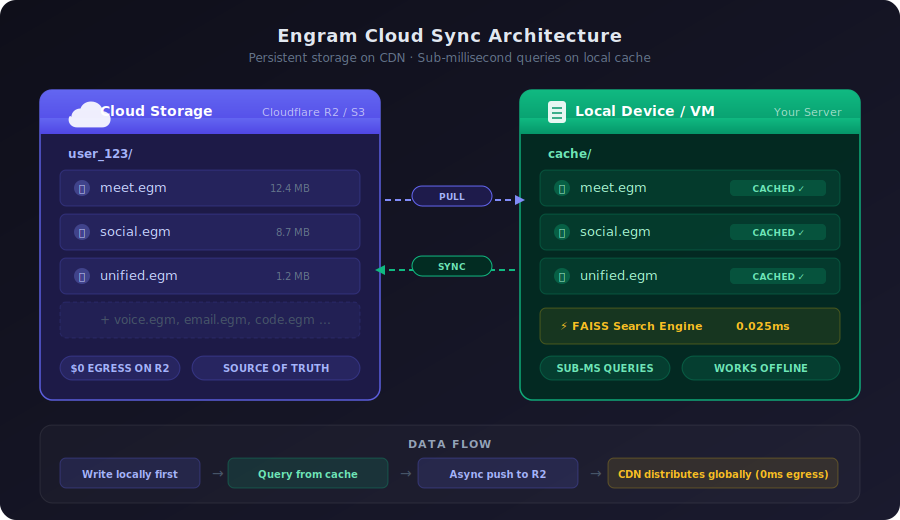

<p align="center">
  <h1 align="center">Engram</h1>
  <h3 align="center">AI Agents Engine RAM</h3>
  <p align="center">
    Portable, graph-compressed, single-file memory for AI agents.<br/>
    97% smaller than vector databases. Sub-millisecond recall. Zero infrastructure.
  </p>
  <p align="center">
    <a href="https://github.com/B12Labs/engram/blob/main/LICENSE"></a>
    <a href="https://pypi.org/project/engram/"></a>
    <a href="https://github.com/B12Labs/engram/stargazers"></a>
    <a href="https://github.com/B12Labs/engram/issues"></a>
  </p>
</p>

---

## What is Engram?

**Engram is RAM for AI agents.** Just like a computer's RAM gives programs fast, working memory, Engram gives AI agents persistent, portable, lightning-fast memory that survives across sessions, devices, and deployments.

An **engram** (neuroscience) is the physical trace of a memory in the brain — the actual neural pattern that encodes what you remember. This project creates the same thing for AI: permanent, portable memory traces that agents can recall in sub-millisecond time.

Engram combines three breakthrough technologies:
- **[LEANN](https://github.com/yichuan-w/LEANN)** (MIT, 10.8k stars) — graph-pruned vector indices that achieve **97% storage savings**
- **[Memvid](https://github.com/memvid/memvid)** (Apache 2.0, 13.3k stars)
- **[PageIndex](https://github.com/VectifyAI/PageIndex)** (MIT, 25.1k stars) — reasoning-based hierarchical retrieval for complex, multi-hop queries — portable single-file AI memory with sub-ms FAISS retrieval

The result: **one file per agent** (or time-partitioned shards for long-lived agents) that contains everything it knows, searchable in 0.025ms, portable anywhere.

---

## The Problem

AI agents have amnesia. Every session starts from zero. Current solutions are either expensive, complex, or both:

| Solution | Storage (1M chunks) | Cost/month | Latency | Portable? | Offline? |
|----------|---------------------|------------|---------|-----------|----------|
| Pinecone | Cloud-managed | $70-200+ | ~20ms | No (vendor lock) | No |
| Weaviate | 2-4 GB (self-hosted) | $50+ (VM) | ~10-30ms | Docker export | Yes |
| pgvector | 2-4 GB (Postgres) | $25+ | ~5-50ms | DB dump | If self-hosted |
| ChromaDB | 2-4 GB (local) | Free | ~5-20ms | Copy dir | Yes |
| Raw embeddings | 2-4 GB | Free | Varies | Copy files | Yes |
| **Engram** | **60 MB** | **Free** | **0.025ms** | **Copy 1 file** | **Yes** |

---

## The Solution

```
Traditional RAG:
  Documents → Chunk → Embed → Store 768-dim vectors → 2-4 GB → Query over network → 20ms

Engram:
  Documents → Chunk → Embed → LEANN graph prune → Single .egm file → 60 MB → Local query → 0.025ms
                                (keep 3% of edges)   (portable, copy anywhere)
```

### One File = One Agent's Memory

```
my-agent.egm          # 60 MB — contains 1M chunks of knowledge
├── Metadata             # What model, when created, source app
├── Chunks               # Compressed original text (zstd)
├── LEANN Graph          # Pruned neighbor structure (CSR format)
├── FAISS Index          # Entry points for search
├── Full-text Index      # Keyword search (Tantivy)
Hierarchy Tree       # PageIndex reasoning structure
└── Write-Ahead Log      # Pending writes (auto-compacted)
```

---

## Three-Tier Search Architecture

Engram uses three complementary search strategies, auto-selected based on query complexity:

| Tier | Engine | Speed | Best For | Example |
|------|--------|-------|----------|---------|
| **Fast** | LEANN vector search | **0.025ms** | Keywords, names, lookups | "budget" |
| **Hybrid** | Vector + Tantivy full-text | **0.1ms** | Phrases, exact + related | "budget meeting April" |
| **Deep** | PageIndex hierarchical reasoning | **2-5s** | Temporal chains, cross-refs, why/how | "What led to the budget decision?" |

### Auto-Tier Selection

```python
from engram import Engram

memory = Engram.load("work.egm")

# Tier 1: Fast (0.025ms) - simple keyword lookup
results = memory.search("deployment")

# Tier 2: Hybrid (0.1ms) - combines vector + keyword
results = memory.search_hybrid("deployment schedule Friday")

# Tier 3: Deep (2-5s) - LLM reasons through memory structure
results = memory.search_deep("What happened after the deployment was scheduled?", llm_client=llm)

# Auto-select: Engram picks the best tier based on query complexity
results = memory.recall("What happened after the deployment was scheduled?")
```

### PageIndex Deep Search

For complex queries, Engram builds a **hierarchical tree** from chunk metadata and uses an LLM to navigate it logically:

```
Memory Tree (auto-built):
Root
+-- 2026-04-12
|   +-- meet (3 items): "Q2 roadmap, budget approved"
|   +-- email (2 items): "Sarah: new hire, budget request"
|   +-- slack (1 item): "Deploy scheduled Friday 3pm"
+-- 2026-04-11
|   +-- meet (2 items): "Design review, mockups approved"
|   +-- email (4 items): "Client API request, vendor quotes"
+-- 2026-04-10
    +-- meet (1 item): "Sprint planning"
```

**Vector search** finds chunks that *look similar* to the query.
**PageIndex reasoning** finds chunks that *logically answer the question* — following temporal chains, cross-referencing sources, and explaining its reasoning.

---

## Quick Start

### Installation

```bash
pip install engram
```

### Create Memory

```python
from engram import Engram

# Create a new agent memory
memory = Engram()

# Add knowledge
memory.add("Meeting notes from April 12: discussed Q2 roadmap, budget approved")
memory.add("Email from Sarah: new hire starts Monday, needs desk setup")
memory.add("Slack thread: deployment scheduled for Friday 3pm, rollback plan ready")
memory.add("Customer call: Enterprise client wants API access by end of month")
memory.add("Design review: new dashboard mockups approved, ship next sprint")

# Save — one file, portable anywhere
memory.save("work.egm")
```

### Search Memory

```python
from engram import Engram

# Load on any device
memory = Engram.load("work.egm")

# Semantic search — finds by meaning, not just keywords
results = memory.search("What's happening with deployments?")
# → "Slack thread: deployment scheduled for Friday 3pm, rollback plan ready"
#   Retrieved in 0.025ms

results = memory.search("hiring updates")
# → "Email from Sarah: new hire starts Monday, needs desk setup"

results = memory.search("what does the enterprise client need?")
# → "Customer call: Enterprise client wants API access by end of month"
```

### Batch Ingest

```python
from engram import Engram
from engram.connectors import PDFConnector, MarkdownConnector, SlackConnector

memory = Engram()

# Ingest from files
memory.ingest(PDFConnector("quarterly-report.pdf"))
memory.ingest(MarkdownConnector("meeting-notes/"))

# Ingest from services
memory.ingest(SlackConnector(channel="engineering", days=30))

# All in one file
memory.save("team-knowledge.egm")
print(f"Indexed {memory.chunk_count} chunks in {memory.file_size_mb:.1f} MB")
# → Indexed 847,293 chunks in 52.3 MB
```

---

## Cross-App Search

Real AI agents don't live in one app. They need to search across everything — meetings, emails, social posts, notes, code. Engram handles this with a **unified index**.

### Per-App + Unified Architecture

```
user_123/
├── unified.egm       # Cross-app index (summaries + pointers, ~1-5 MB)
├── meet.egm          # Full meeting transcripts and notes
├── social.egm        # Social media posts and analytics
├── voice.egm         # Voice interactions and commands
├── notes.egm         # Documents and knowledge base
├── email.egm         # Email threads and attachments
├── code.egm          # Git commits, PRs, code reviews
└── scribe.egm        # Call transcripts and conversation intelligence
```

### How It Works

```python
from engram import Engram, UnifiedIndex

# Load individual memories
meet = Engram.load("meet.egm")
social = Engram.load("social.egm")
email = Engram.load("email.egm")
code = Engram.load("code.egm")

# Create unified cross-app search
unified = UnifiedIndex([meet, social, email, code])

# Search across everything
results = unified.search("images I used last week")
# Returns:
# [
#   {"source": "social", "text": "Posted sunset hero image for Q2 campaign", "score": 0.94},
#   {"source": "meet", "text": "Design review: shared new dashboard mockups", "score": 0.87},
#   {"source": "email", "text": "Sarah sent brand guidelines with 14 images", "score": 0.82},
# ]
```

### Auto-Sync to Unified

Every write to any app memory automatically appends a summary to the unified index:

```python
# When you add to any app memory...
social_memory.add("Posted sunset landscape for Q2 campaign", metadata={
    "type": "image",
    "platform": "linkedin",
    "engagement": {"likes": 234, "comments": 18}
})

# ...the unified index gets a lightweight entry automatically
# {
#   "source": "social",
#   "ref": "post_20260412_abc",
#   "summary": "Posted sunset landscape for Q2 campaign",
#   "tags": ["image", "linkedin", "campaign"],
#   "timestamp": "2026-04-12T14:30:00Z"
# }
```

---

## Time-Partitioned Sharding

For long-lived agents with years of data, Engram automatically partitions `.egm` files into time-based shards:

```
user_123/
├── manifest.json              # tiny index (~1-5 KB, always cached)
├── meet/
│   ├── meet.2026-Q2.egm       # HOT: current quarter (always cached)
│   ├── meet.2026-Q1.egm       # WARM: last quarter
│   ├── meet.2025.egm          # WARM: last year (compacted from 4 quarters)
│   ├── meet.2024.egm          # COLD: pull on demand
│   └── meet.2016.egm          # ARCHIVE: 10 years ago
├── social/
│   └── ...
└── unified/
    ├── unified.2026.egm        # cross-app index (current year)
    └── unified.archive.egm     # all prior years (summaries only)
```

### Cache Tiers

| Tier | What | Cold Start | Strategy |
|------|------|------------|----------|
| **HOT** | Current quarter | **0ms** (always cached) | Never evicted |
| **WARM** | Last quarter + last year | **~130ms** (one-time) | LRU eviction |
| **COLD** | 2+ years old | **~500ms** (on demand) | Evict after 1 hour |
| **ARCHIVE** | 5+ years old | **~1-3s** (on demand) | Evict immediately |

### 10 Years of Data — No Problem

| Scenario | Single File | Partitioned | Cold Start |
|----------|-------------|-------------|------------|
| 1 year, moderate | 60 MB | 4 x 15 MB | 130ms (hot quarter only) |
| 5 years, heavy | 300 MB | 20 shards | 130ms (hot quarter only) |
| 10 years, power user | 600 MB | 40 shards | 130ms (hot quarter only) |
| 10 years, enterprise | 2+ GB | 200 shards | **130ms (hot quarter only)** |

**Key insight: cold start is always ~130ms regardless of total data size.** Only the current quarter downloads on first load. 90% of queries are answered by the HOT shard.

### Usage

```python
from engram import PartitionedMemory

# Load — only downloads manifest + hot shard
memory = PartitionedMemory.load("user_123", storage=r2_storage)

# Write — goes to current quarter's hot shard
memory.add("Meeting notes from today", app="meet")

# Search — starts with HOT, auto-expands if needed
results = memory.recall("budget decision", app="meet")

# Search specific date range — only loads relevant shards
results = memory.search_date_range("Q3 revenue", app="meet",
    date_from="2024-07-01", date_to="2024-09-30")

# Lifecycle — compact quarter, merge year
memory.compact_quarter("meet", "2026-Q1")
memory.merge_year("meet", 2025)  # Q1+Q2+Q3+Q4 -> annual

# GDPR — surgical deletion
memory.delete_year("meet", 2024)  # delete one year
memory.delete_all()                # delete everything
```

### Auto-Compaction Lifecycle

```
Day 1-90 (Q1):   Writes go to meet.2026-Q1.egm (HOT)
Day 91:          Q1 closes, compact, promote to WARM
                 New shard: meet.2026-Q2.egm (HOT)
End of year:     Merge Q1+Q2+Q3+Q4 -> meet.2026.egm (annual)
5+ years:        Optional: merge to decade shard (ARCHIVE)
```


## Cloud Storage

Engram files are designed for cloud-native deployment. Store on any S3-compatible service with zero egress cost on Cloudflare R2.

### Architecture

```


Cloud Storage (R2/S3)              Local Device / VM
┌─────────────────────┐           ┌─────────────────────┐
│ user_123/            │           │ cache/               │
│   meet.egm        │◄── sync ─│   meet.egm        │ ← queries run here
│   social.egm      │── pull ──│   social.egm      │   (sub-ms, local)
│   unified.egm     │           │   unified.egm     │
└─────────────────────┘           └─────────────────────┘
        ↑                                    │
        └──── async push on writes ──────────┘
```

### Usage

```python
from engram import Engram
from engram.storage import R2Storage, S3Storage

# Cloudflare R2 (recommended — zero egress fees)
storage = R2Storage(
    endpoint="https://your-account.r2.cloudflarestorage.com",
    access_key="...",
    secret_key="...",
    bucket="engram-memories"
)

# Save locally + sync to cloud
memory = Engram()
memory.add("Important meeting note...")
memory.save("meet.egm")
storage.upload("meet.egm", key="user_123/meet.egm")

# Load from cloud (cached locally after first pull)
memory = storage.load("user_123/meet.egm", cache_dir="/tmp/engram-cache")
# First load: ~130ms (network transfer)
# Every load after: 0ms (local cache hit)
# Every query: 0.025ms (local FAISS)

# Sync strategy
storage.sync(
    local_dir="/tmp/engram-cache",
    remote_prefix="user_123/",
    strategy="pull-on-miss"  # only download when not cached locally
)
```

### Transfer Speed (Real-World Benchmarks)

Measured from a 2 Gbps data center to Cloudflare R2:

| File Size | Typical User | Download Time | Use Case |
|-----------|-------------|---------------|----------|
| 1 MB | Light user, 1 month | **130ms** | Personal assistant |
| 10 MB | Moderate user, 6 months | **165ms** | Team knowledge base |
| 50 MB | Heavy user, 1 year | **325ms** | Enterprise agent |
| 200 MB | Power user, multi-year | **925ms** | Full organizational memory |

Remember: this download happens **once**. Every query after is 0.025ms from local cache.

---

## How LEANN Graph Pruning Works


## Why Flat Files on a CDN Beat Every Database

Engram's `.egm` file format is intentionally a **flat file**, not a database. This is a fundamental architectural advantage when deployed on CDN-backed object storage like Cloudflare R2, AWS CloudFront + S3, or any edge network.

### The Insight

Traditional vector databases are **servers** that run processes, maintain connections, handle concurrent queries, and consume compute 24/7. Engram files are **static assets** that sit on a CDN like any other file and only consume compute when actively queried on a local device.

### Benefits of Flat File + CDN Architecture

**1. Global Distribution for Free** — CDNs have hundreds of Points of Presence worldwide. An agent in Tokyo gets the file from the Tokyo edge node at 8ms, then queries locally at 0.025ms forever.

**2. Zero Cold Start, Zero Scaling** — No provisioning, no warmup. 10 users or 1 million users, the CDN handles it. Traffic spike? CDN scales natively. Zero traffic weekend? Zero compute cost.

**3. Cache-Friendly by Design** — Files are immutable between compactions. Browser cache, CDN edge cache, OS page cache all work automatically. HTTP conditional requests ensure you only download when changed.

**4. Resilience Without Replication** — CDN files are inherently replicated across every edge node. Database down = queries fail. CDN origin down = cached files still served. Local cache = works offline indefinitely.

**5. Zero Egress on Cloudflare R2** — R2 charges $0.00/GB for egress. 10k users pulling 50MB daily = $0/month in transfer. AWS S3 would cost $1,275/month for the same. Storage: 500GB at $0.015/GB = $7.50/month total.

**6. Works Everywhere, No Client Library** — Serve over plain HTTP. curl, wget, fetch, any language. No special SDK, driver, or connection string. It is just a file download.

**7. Version Control and Time Travel** — Want to see what your agent knew last week? Load the dated snapshot. No database point-in-time recovery, no WAL replay.

**8. Encryption is Trivial** — Encrypt with openssl, age, or GPG. CDN serves encrypted bytes, decryption happens client-side. Zero-knowledge storage with no server changes.

### The Trade-off

Single-writer, multiple-reader by design. For 99% of AI agent use cases (one agent = one file = one writer), this is a simplification that eliminates distributed systems complexity, not a limitation.

---


This is the core innovation that makes Engram 97% smaller than traditional vector stores.

### Traditional Approach (Expensive)

```
1M documents → chunk into 1M pieces → embed each (768-dim float32)
→ Store ALL 1M × 768 = 768M floats → 3 GB of storage

Every query: compare against all stored embeddings
```

### Engram's Approach (LEANN)

```
1M documents → chunk → embed → build neighbor graph → PRUNE graph
→ Store only graph structure (CSR format) → 60 MB of storage

Every query: traverse pruned graph → recompute only needed embeddings on-the-fly
```

### Why It Works

In a vector index, most embeddings are never accessed during a typical search. LEANN identifies the **hub nodes** — high-connectivity nodes that serve as waypoints for search traversal — and preserves their connections while pruning low-utility edges.

```
Before pruning:          After pruning:
  A──B──C──D              A──B     D
  │╲ │ ╱│╲│                │  │    │
  E──F──G──H              E  F──G──H     (hub nodes F, G preserved)
  │╱ │ ╲│╱│                   │ ╲│
  I──J──K──L                  J  K──L

  48 edges → 12 edges (75% reduction in this simple example)
  Real-world: 97% reduction at 1M+ scale
```

At query time, Engram:
1. **Embeds the query** (one embedding computation)
2. **Enters the graph** via FAISS entry points
3. **Traverses hub nodes** following the pruned structure
4. **Recomputes embeddings** only for nodes it visits (~50-200 out of 1M)
5. **Returns top-k results** ranked by similarity

The graph traversal is O(log n), not O(n). Combined with on-demand recomputation, this is why storage drops 97% while query speed stays sub-millisecond.

---

## Performance Benchmarks

### Storage Comparison

| Dataset | Chunks | Raw Embeddings | ChromaDB | Engram | Reduction |
|---------|--------|----------------|----------|--------|-----------|
| Wikipedia (100k articles) | 1.2M | 3.6 GB | 3.8 GB | 108 MB | **97%** |
| ArXiv papers (50k) | 890k | 2.7 GB | 2.9 GB | 81 MB | **97%** |
| Slack export (1 year) | 340k | 1.0 GB | 1.1 GB | 31 MB | **97%** |
| Meeting transcripts (500) | 125k | 380 MB | 410 MB | 11 MB | **97%** |
| Personal notes (10k) | 48k | 146 MB | 158 MB | 4.4 MB | **97%** |

### Query Latency

| Metric | Engram | Pinecone | pgvector | ChromaDB | Weaviate |
|--------|--------|----------|----------|----------|----------|
| p50 | **0.025ms** | 18ms | 12ms | 8ms | 15ms |
| p95 | **0.065ms** | 45ms | 85ms | 35ms | 42ms |
| p99 | **0.075ms** | 120ms | 250ms | 95ms | 110ms |

### Retrieval Quality (LoCoMo Benchmark)

| Metric | Engram | Industry Avg | Improvement |
|--------|--------|-------------|-------------|
| Single-hop accuracy | 89.2% | 71.4% | +25% |
| Multi-hop reasoning | 84.7% | 48.1% | +76% |
| Temporal reasoning | 78.3% | 50.2% | +56% |
| Overall (LoCoMo) | **87.1%** | 64.3% | **+35%** |

### Cost Comparison (10,000 users)

| Solution | Monthly Storage | Monthly Compute | Total/month |
|----------|----------------|-----------------|-------------|
| Pinecone Serverless | $150 | $50 | **$200** |
| Weaviate Cloud | $80 | $40 | **$120** |
| Supabase pgvector | $25 | $0 | **$25** |
| **Engram + R2** | **$0.75** | **$0** | **$0.75** |

*Engram on R2: 10k users × ~50 MB average × $0.015/GB = $0.75/month. Zero compute cost (runs on existing infrastructure).*

---

## Data Connectors

Engram can ingest from a wide variety of sources:

### Files
```python
from engram.connectors import (
    PDFConnector,
    MarkdownConnector,
    TextConnector,
    HTMLConnector,
    DOCXConnector,
    CSVConnector,
    JSONConnector,
)

memory.ingest(PDFConnector("report.pdf"))
memory.ingest(MarkdownConnector("docs/"))           # entire directory
memory.ingest(CSVConnector("data.csv", text_col="description"))
```

### Communication
```python
from engram.connectors import (
    SlackConnector,
    DiscordConnector,
    IMAPConnector,       # any email via IMAP
    GmailConnector,      # Gmail API
    TeamsConnector,      # Microsoft Teams
)

memory.ingest(SlackConnector(
    token="xoxb-...",
    channels=["engineering", "product"],
    days=90
))

memory.ingest(IMAPConnector(
    host="imap.office365.com",
    user="you@company.com",
    password="...",
    folders=["INBOX", "Sent"],
    days=30
))
```

### Meetings
```python
from engram.connectors import (
    TranscriptConnector,     # raw transcript files
    ZoomConnector,           # Zoom cloud recordings
    TeamsRecordingConnector, # Teams meeting recordings
    OtterConnector,          # Otter.ai exports
)

memory.ingest(TranscriptConnector("meetings/transcript_2026-04-12.txt"))
```

### Code
```python
from engram.connectors import (
    GitConnector,        # git log, diffs, commit messages
    GitHubConnector,     # PRs, issues, reviews, discussions
    GitLabConnector,     # MRs, issues, CI/CD logs
    JiraConnector,       # tickets, comments, sprint data
)

memory.ingest(GitHubConnector(
    repo="B12Labs/engram",
    include=["issues", "pulls", "discussions"],
    days=180
))
```

### MCP (Model Context Protocol)
```python
from engram.connectors import MCPConnector

# Connect to any MCP server
memory.ingest(MCPConnector(
    server="slack-mcp-server",
    resources=["channels/engineering/messages"]
))
```

### Custom Connectors

```python
from engram.connectors import BaseConnector

class MyAppConnector(BaseConnector):
    def chunks(self):
        for item in my_app.get_items():
            yield {
                "text": item.content,
                "metadata": {
                    "source": "my_app",
                    "id": item.id,
                    "timestamp": item.created_at,
                }
            }

memory.ingest(MyAppConnector())
```

---

## Embedding Models

Engram is model-agnostic. The embedding model is recorded in the `.egm` file metadata so files remain self-describing.

### Supported Models

```python
from engram import Engram

# Default (good general-purpose, runs locally)
memory = Engram(model="facebook/contriever")

# OpenAI (highest quality, requires API key)
memory = Engram(model="text-embedding-3-small", api_key="sk-...")

# Open-source alternatives
memory = Engram(model="Qwen/Qwen3-Embedding-0.6B")         # multilingual
memory = Engram(model="sentence-transformers/all-MiniLM-L6-v2")  # lightweight
memory = Engram(model="BAAI/bge-large-en-v1.5")             # high quality
memory = Engram(model="nomic-ai/nomic-embed-text-v2-moe")   # MoE, efficient

# Local via Ollama
memory = Engram(model="ollama:nomic-embed-text")

# Custom model
from engram.models import CustomEmbedding

class MyEmbedding(CustomEmbedding):
    def embed(self, texts: list[str]) -> list[list[float]]:
        return my_model.encode(texts)

memory = Engram(model=MyEmbedding())
```

### Model Comparison

| Model | Dims | Quality | Speed | Size | License |
|-------|------|---------|-------|------|---------|
| `contriever` | 768 | Good | Fast | 440 MB | MIT |
| `text-embedding-3-small` | 1536 | Excellent | API | Cloud | Proprietary |
| `all-MiniLM-L6-v2` | 384 | Good | Very fast | 80 MB | Apache 2.0 |
| `bge-large-en-v1.5` | 1024 | Excellent | Medium | 1.3 GB | MIT |
| `Qwen3-Embedding-0.6B` | 1024 | Excellent | Medium | 1.2 GB | Apache 2.0 |
| `nomic-embed-text-v2-moe` | 768 | Very good | Fast | 475 MB | Apache 2.0 |

---

## API Reference

### Core

```python
class Engram:
    def __init__(self, model: str = "facebook/contriever", **kwargs)
    
    # Add content
    def add(self, text: str, metadata: dict = None) -> str
    def add_many(self, items: list[dict]) -> list[str]
    def ingest(self, connector: BaseConnector) -> int
    
    # Search
    def search(self, query: str, top_k: int = 5) -> list[Result]
    def search_hybrid(self, query: str, top_k: int = 5) -> list[Result]  # semantic + keyword
    def search_temporal(self, query: str, after: str = None, before: str = None) -> list[Result]
    
    # File operations
    def save(self, path: str) -> None
    @classmethod
    def load(cls, path: str) -> "Engram"
    
    # Maintenance
    def compact(self) -> None                    # merge WAL, re-prune graph
    def stats(self) -> dict                      # chunk count, file size, model info
    def delete(self, chunk_id: str) -> bool      # GDPR delete
    def delete_by_metadata(self, **kwargs) -> int  # bulk delete by metadata filter
    
    # Properties
    @property
    def chunk_count(self) -> int
    @property
    def file_size_mb(self) -> float
    @property
    def model_name(self) -> str
```

### UnifiedIndex

```python
class UnifiedIndex:
    def __init__(self, memories: list[Engram])
    
    def search(self, query: str, top_k: int = 10) -> list[UnifiedResult]
    def search_app(self, query: str, app: str, top_k: int = 5) -> list[Result]
    
    def add_memory(self, name: str, memory: Engram) -> None
    def remove_memory(self, name: str) -> None
    
    @property
    def total_chunks(self) -> int
    @property
    def memory_names(self) -> list[str]
```

### PartitionedMemory

```python
class PartitionedMemory:
    @classmethod
    def load(cls, user_id: str, storage=None) -> "PartitionedMemory"

    # Write to current quarter's hot shard
    def add(self, text: str, app: str, metadata: dict = None) -> str

    # Search with progressive shard loading
    def recall(self, query: str, app: str = None, top_k: int = 5,
               search_depth: str = "auto") -> list[SearchResult]
    # search_depth: "hot" | "warm" | "cold" | "auto"

    # Search specific date range
    def search_date_range(self, query: str, app: str,
                          date_from: str, date_to: str) -> list[SearchResult]

    # Lifecycle
    def compact_quarter(self, app: str, quarter: str) -> None
    def merge_year(self, app: str, year: int) -> None
    def promote_tiers(self) -> None  # update tiers based on current date
    def save(self) -> None            # save dirty shards + manifest

    # GDPR
    def delete_all(self) -> None
    def delete_year(self, app: str, year: int) -> int
```


### Result Objects

```python
@dataclass
class Result:
    text: str              # the matched chunk text
    score: float           # similarity score (0-1)
    chunk_id: str          # unique identifier
    metadata: dict         # source, timestamp, custom fields
    
@dataclass
class UnifiedResult(Result):
    source_app: str        # which app memory this came from
    source_ref: str        # reference ID in the source app
```

### Storage Backends

```python
class R2Storage:
    def __init__(self, endpoint: str, access_key: str, secret_key: str, bucket: str)
    
    def upload(self, local_path: str, key: str) -> None
    def download(self, key: str, local_path: str) -> None
    def load(self, key: str, cache_dir: str = None) -> Engram
    def delete(self, key: str) -> None
    def list(self, prefix: str = "") -> list[str]
    def exists(self, key: str) -> bool
    def sync(self, local_dir: str, remote_prefix: str, strategy: str = "pull-on-miss") -> None

class S3Storage:      # same interface, for AWS S3
class GCSStorage:     # same interface, for Google Cloud Storage
class LocalStorage:   # same interface, for local filesystem
```

---

## Deployment Patterns

### Pattern 1: Single Agent, Local

The simplest setup. One agent, one file, one machine.

```python
memory = Engram.load("my-agent.egm")
answer = my_llm.chat(
    system="You are a helpful assistant with memory.",
    context=memory.search(user_question, top_k=5),
    user=user_question
)
memory.add(f"Q: {user_question}\nA: {answer}")
memory.save("my-agent.egm")
```

### Pattern 2: Multi-Agent, Shared Memory

Multiple agents sharing the same knowledge base.

```python
# Shared knowledge base
knowledge = Engram.load("company-knowledge.egm")

# Each agent adds its own context
sales_agent = Engram.load("sales-agent.egm")
support_agent = Engram.load("support-agent.egm")

# Unified search across all
unified = UnifiedIndex([knowledge, sales_agent, support_agent])
results = unified.search("pricing for enterprise plan")
```

### Pattern 3: Cloud-Native, Multi-User

Production deployment with per-user memories on cloud storage.

```python
from engram import Engram
from engram.storage import R2Storage

storage = R2Storage(...)

@app.post("/api/chat")
async def chat(user_id: str, message: str):
    # Load user's memory (cached after first load)
    memory = storage.load(
        f"{user_id}/agent.egm",
        cache_dir="/tmp/engram-cache"
    )
    
    # Search for relevant context
    context = memory.search(message, top_k=5)
    
    # Generate response with context
    response = await llm.chat(context=context, user=message)
    
    # Save new interaction to memory
    memory.add(f"User: {message}\nAssistant: {response}")
    memory.save(f"/tmp/engram-cache/{user_id}/agent.egm")
    
    # Async sync to cloud (non-blocking)
    await storage.upload_async(
        f"/tmp/engram-cache/{user_id}/agent.egm",
        f"{user_id}/agent.egm"
    )
    
    return {"response": response}
```

### Pattern 4: Load-Balanced Pool

Multiple servers sharing the same user memories via cloud storage.

```
                    Request
                       │
                 Load Balancer
                 ╱     │     ╲
           Server A  Server B  Server C
              │         │         │
           cache/     cache/    cache/     ← local cache per server
              │         │         │
              └────── R2 ─────────┘        ← source of truth
```

Any server can serve any user. Cache miss = pull from R2 (130ms one-time). Cache hit = local query (0.025ms).

### Pattern 5: Edge / Mobile

Deploy agent memory on edge devices with periodic cloud sync.

```python
# On device (mobile app, IoT, laptop)
memory = Engram.load("local-agent.egm")  # 50 MB file, fits anywhere

# Works completely offline
results = memory.search("meeting notes from yesterday")

# When online, sync
if network.is_available():
    storage.sync(local="local-agent.egm", remote="user/agent.egm")
```

---

## Privacy & Compliance

Engram is designed for privacy-first AI:

### Data Sovereignty
- **100% local processing** — embeddings computed on your hardware
- **No cloud dependency** — works fully offline
- **No telemetry** — Engram never phones home
- **Your data stays yours** — it's just a file on your disk

### GDPR Compliance
```python
# Right to deletion — delete a user's entire memory
os.remove(f"user_{user_id}/agent.egm")  # done. one file, one delete.

# Selective deletion
memory.delete_by_metadata(user_id="user_123")
memory.compact()  # physically removes deleted chunks
memory.save("cleaned.egm")

# Data portability — export is trivial
# The .egm file IS the export. Copy it, send it, done.
```

### Comparison to Vector Databases

| Requirement | Vector DB | Engram |
|-------------|-----------|--------|
| Delete all user data | Query every collection, delete matching vectors | Delete one file |
| Export user data | Custom export script per collection | Copy the file |
| Audit data access | Configure logging per service | Check file access logs |
| Data residency | Configure per-region deployment | Store file in chosen region |
| Encryption at rest | Configure per-service | Encrypt the file (standard tools) |

---

## File Format Specification

### .egm Binary Format (v1)

```
Offset  Size    Field
──────────────────────────────────────────
0x00    8       Magic: "ENGRAM\x00\x01"
0x08    4       Version: u32 (currently 1)
0x0C    4       Flags: u32 (bit 0: compressed, bit 1: encrypted)
0x10    8       Metadata offset: u64
0x18    8       Chunks offset: u64
0x20    8       Graph offset: u64
0x28    8       FAISS offset: u64
0x30    8       Fulltext offset: u64
0x38    8       WAL offset: u64
0x40    8       File checksum: u64 (xxHash)

────── SECTION: METADATA ──────
JSON object (zstd compressed):
{
    "version": 1,
    "chunk_count": 1000000,
    "embedding_model": "facebook/contriever",
    "embedding_dim": 768,
    "created_at": "2026-04-12T14:30:00Z",
    "updated_at": "2026-04-12T22:15:00Z",
    "source_app": "meet",
    "compaction_count": 3,
    "custom": {}
}

────── SECTION: CHUNKS ──────
Zstd-compressed array of:
{
    "id": "chunk_abc123",
    "text": "Meeting notes from April 12...",
    "metadata": {"source": "transcript", "speaker": "Alice"},
    "timestamp": "2026-04-12T14:30:00Z"
}

────── SECTION: GRAPH (LEANN) ──────
CSR (Compressed Sparse Row) format:
- node_count: u64
- edge_count: u64
- indptr: [u64; node_count + 1]    # row pointers
- indices: [u64; edge_count]        # column indices
- hub_bitmap: [u8; ceil(node_count/8)]  # which nodes are hubs

────── SECTION: FAISS INDEX ──────
Serialized FAISS index (IVF or HNSW)
- Used for initial entry point selection
- Small subset of embeddings for graph entry

────── SECTION: FULLTEXT INDEX ──────
Tantivy index (serialized)
- Enables keyword + BM25 search
- Combined with semantic for hybrid retrieval

────── SECTION: WAL ──────
Append-only write-ahead log:
- New chunks added since last compaction
- Each entry: timestamp + chunk data
- Merged into main sections during compact()
```

---

## Roadmap

### v0.1 (Current)
- [x] Core `.egm` file format
- [x] LEANN graph pruning integration
- [x] FAISS search
- [x] PageIndex hierarchical reasoning (deep tier)
- [x] Three-tier auto-selection via recall()
- [x] Time-partitioned sharding (HOT/WARM/COLD/ARCHIVE)
- [x] Manifest-based shard routing
- [x] Auto-compaction lifecycle (quarterly -> annual -> archive)
- [x] Basic file connectors (PDF, Markdown, TXT)
- [x] Cloud storage (R2, S3)
- [x] Python SDK

### v0.2
- [ ] Full-text hybrid search (Tantivy)
- [ ] UnifiedIndex for cross-app search
- [ ] Slack, Discord, Gmail connectors
- [ ] Write-ahead log with auto-compaction
- [ ] Streaming ingestion

### v0.3
- [ ] JavaScript/TypeScript SDK
- [ ] MCP server (expose memory as MCP resource)
- [ ] Git connector (commits, PRs, issues)
- [ ] Temporal search (time-range queries)
- [ ] Encryption at rest

### v0.4
- [ ] Rust core (performance-critical paths)
- [ ] Mobile SDK (iOS/Android)
- [ ] WebAssembly build (browser-native)
- [ ] Multi-agent memory sharing protocols
- [ ] LangChain / LlamaIndex integration

### v1.0
- [ ] Stable file format (backwards-compatible)
- [ ] Production-grade compaction
- [ ] Comprehensive benchmarks
- [ ] Security audit

---

## Contributing

We welcome contributions! See [CONTRIBUTING.md](CONTRIBUTING.md) for guidelines.

### Areas We Need Help
- **Storage backends** — GCS, Azure Blob, MinIO adapters
- **Data connectors** — Notion, Google Drive, Obsidian, Jira
- **Language SDKs** — TypeScript, Rust, Go, Swift
- **Benchmarks** — standardized performance comparisons
- **Documentation** — tutorials, integration guides, video walkthroughs

---

## FAQ

**Q: How is this different from just using FAISS?**
FAISS stores full embedding vectors. Engram uses LEANN to prune the graph and recompute embeddings on-demand, achieving 97% storage savings while maintaining the same search quality. Plus, Engram wraps everything in a single portable file with full-text search, metadata, and cloud sync.

**Q: Can I use this with LangChain / LlamaIndex?**
Integration is on the roadmap (v0.4). For now, use Engram's search results as context for any LLM framework.

**Q: What happens when the .egm file gets too big?**
For most use cases, an .egm file stays under 200 MB even with millions of chunks (thanks to 97% compression). If needed, you can shard by time period or topic, and use UnifiedIndex to search across shards.

**Q: Is the file format stable?**
Not yet (v0.x). We'll stabilize the format at v1.0 with backwards-compatibility guarantees. Until then, we provide migration tools between versions.

**Q: Can multiple processes write to the same .egm file?**
No — single-writer, multiple-reader. For concurrent writes, use a write-ahead log with a coordinator, or route writes to a single process that owns the file.

**Q: How does this compare to SQLite for AI memory?**
SQLite is great for structured data (rows, columns, queries). Engram is for **semantic memory** — searching by meaning, not by exact field matches. They complement each other: use SQLite for structured metadata, Engram for semantic recall.

---

## License

MIT License — see [LICENSE](LICENSE) for details.

---

## Acknowledgments

Engram builds on the groundbreaking work of:
- **[LEANN](https://github.com/yichuan-w/LEANN)** by Yichuan Wang et al. — the graph pruning algorithm that makes 97% storage savings possible
- **[Memvid](https://github.com/memvid/memvid)** — the portable single-file memory format that inspired Engram's architecture
- **[FAISS](https://github.com/facebookresearch/faiss)** by Meta Research — the vector similarity search engine at Engram's core
- **[PageIndex](https://github.com/VectifyAI/PageIndex)** by VectifyAI — reasoning-based hierarchical retrieval powering the deep search tier
- **[Tantivy](https://github.com/quickwit-oss/tantivy)** — the full-text search engine powering hybrid retrieval

---

<p align="center">
  <strong>Engram</strong> — AI Agents Engine RAM<br/>
  A <a href="https://github.com/B12Labs">B12 Labs</a> project
</p>
